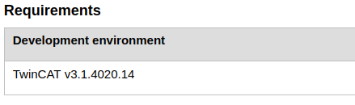

# InfoSysCrawler

Crawler for [Beckhoff's InfoSys](https://infosys.beckhoff.com/index_en.htm).

## How it works

The crawler goes through the InfoSys menu and finds all subfolders and pages. It is not necessary to start at a top folder, but you can also start at a lower folder. Optionally some folders/pages can be ignored.

### Current application

This crawler can be used to walk through InfoSys pages and look for a TwinCAT version number. The version number is often found on the bottom of a page, as shown below. 



The version numbers are used for the [unofficial TwinCAT changelog](https://tcchanges.cookncode.com).

## How to use it

1. Build the project using `dotnet build`.
2. Open a FSharp interactive console.
3. Import the dll using `#r "InfoSysCrawler/bin/Debug/net6.0/InfoSysCrawler.dll"`, where you should change the path of the dll according to where it is saved on your local system.
4. Then you can crawl a subfolder as follows:
    ```fsharp
    open InfoSysCrawler.SiteMap
    open InfoSysCrawler.Request

    let url = (Url "https://infosys.beckhoff.com/english/menu/menu.php?id=8644252870837316006") // TC1xxx - TwinCAT 3 base // 5 s
    // Add folder names you do not want to into
    let ignoreFolders = ["Foreword"; "Installation"; "Samples"]
    // Add pages which you do not want to look for a twincat version number
    let ignorePages = ["Overview"; "Search"]
    // Start crawling
    let menu = traverseMenu ignoreFolders ignorePages url

    // Output you should see
    TC1000 | TwinCAT 3 ADS
    TC1100 | TwinCAT 3 I/O
    TC1200 | TwinCAT 3 PLC
    TC1210 | TwinCAT 3 PLC/C++
    TC1220 | TwinCAT 3 PLC/C++/MATLAB®/Simulink®
    TC1250 | TwinCAT 3 PLC/NC PTP 10
    TC1260 | TwinCAT 3 PLC/NC PTP 10/NC I
    TC1270 | TwinCAT 3 PLC/NC PTP 10/NC I/CNC
    TC1275 | TwinCAT 3 PLC/NC PTP 10/NC I/CNC E
    TC1300 | TwinCAT 3 C++
    TC1320 | TwinCAT 3 C++/MATLAB®/Simulink®
    ```
5. You can save the crawled data with `menu |> saveAsJson "menu.json"`
6. You can later open the data again with
    ```fsharp
    #r "InfoSysCrawler/FSharp.Json.dll"

    open FSharp.Json

    let deserialized = Json.deserialize<Node list> (File.ReadAllText("menu.json"))
    ```

## Current dumps

In `data/` you will find a few folders which are crawled and saved as a json file. Currently the following folders were crawled where the folders "Foreword", "Installation" and "Samples" and the pages "Overview" and "Search" are ignored. On ignored pages/folders the crawler doesn't try to find a TwinCAT version number. Data was last updated on 15 April 2022.

- `data/plc_libraries.json`: TwinCAT 3/TE1000 XAE/PLC/PLC Libraries
- `data/texxxx.json`: TwinCAT 3/TExxxx | TwinCAT 3 Engineering 
- `data/tc1xxx.json`: TwinCAT 3/TC1xxx | TwinCAT 3 Base
- `data/tfxxxx.json`: TwinCAT 3/TFxxxx | TwinCAT 3 Functions
